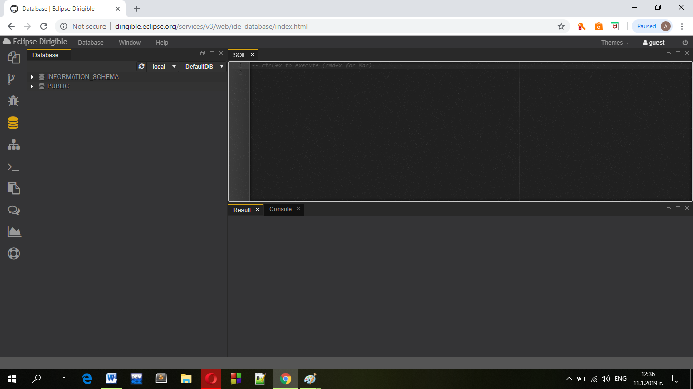
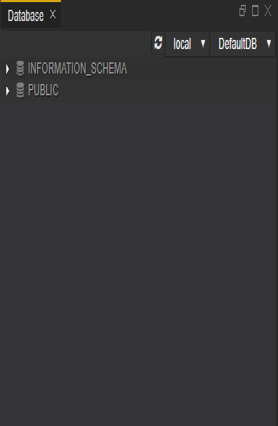
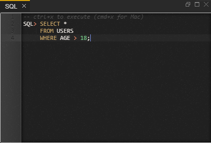
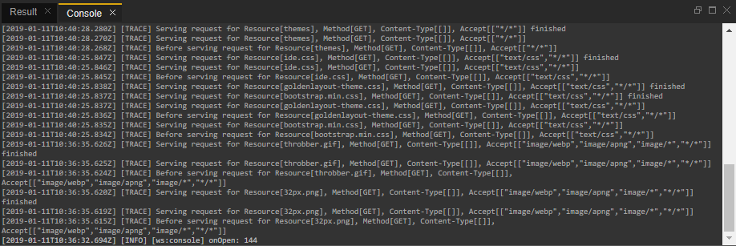

#
# Database Perspective

#

 

The Database perspective contains tools for inspection and manipulation of the artifacts within the underlying relational database.

 
 
 
It is comprised of the following views:

- Database
- SQL
- Result
- Console

The Database perspective features a:

- database explorer
- console to execute SQL statements and to preview results in table format

**Views**

**Database view**

The Database view gives you direct access to the default target schema assigned to your account in the Web IDE. It enables you to expand the schema item and see the list of all tables and views created either via the data structures models or directly via SQL script.

 
 
**SQL view**

The SQL view is one of the most powerful and dangerous tool for database management. In the SQL console you can enter the SQL script compliant to the underlying database system. You get the result of the execution in the Results view below.

 
 
**Result view**

The Result view displays the output of the code that you are executing in the SQL console

**Console view**

 
 
The Console view is a major debugging tool. It displays the output of the code that you are executing.

### Features

### Data Structures

- Creation of table model (JSON formatted  **\*.table**  descriptor) and actual creation of the corresponding database table during publishing.
- Creation of view model (JSON formatted  **\*.view**  descriptor) and actual creation of the corresponding database view during publishing.
- Creation of delimiter separated values ( **\*.append** ,  **\*.update** ,  **\*.delete** ,  **\*.replace** ) data files and populating the corresponding database table during publishing.
- Automatic altering of existing tables from the models on compatible changes (new columns added).
- Modelling of the database schema ( **\*.dsm**  and  **\*.schema** ) files and creation of the tables, views and constraints during publishing.

### Tooling

- _Database_ perspective for RDBMS management including SQL Console
