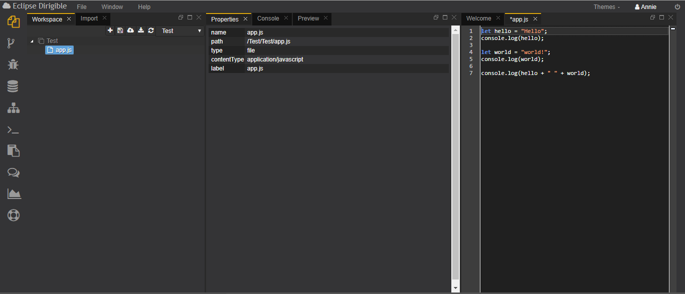
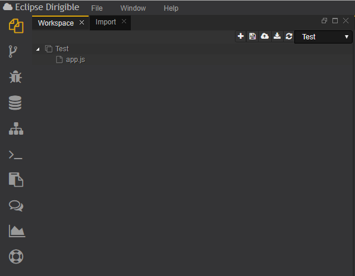
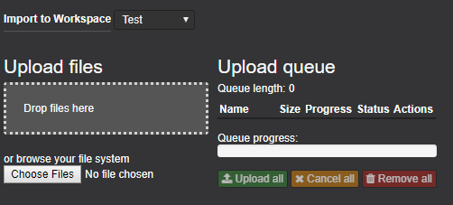
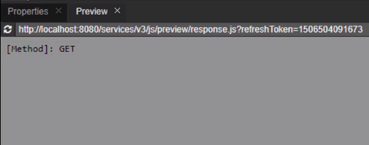
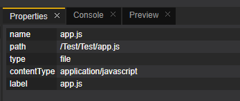
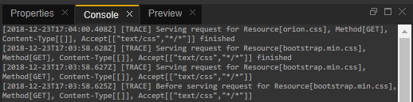

# Workbench перспектива
Workbench перспективата съдържа всички изгледи и редактори, които могат да помогнат при цялостното изпълнение, от модели на домейни чрез услуги до потребителския интерфейс.
Перспективата на Workbench се състои от няколко изгледа: Workspace, Import, Properties, Console и Preview, както и редактори, подходящи за всеки тип файл. С други думи, минималният набор от инструменти за управление на файлове, визуализация и редактиране.

## *Workspace перспективата*
Workspace е мястото на разработчика, където той / тя създава и управлява файловете на приложението си и проектите си. Всеки проект може да съдържа множество папки и файлове.Един потребител може да има множество работни пространства(workspaces), съдържащи различен набор от проекти.

## *Импортиране*
Секцията Import позволява на потребителя да качи файл, с каквото и да е разширение или зип файл, съдържащ един или повече проекти, в избраното работно пространство. Изгледът включва лента, която показва процеса на качване на файловете в работното пространство. Потребителят може да управлява и да превключва между няколко работни пространства чрез менюто Workspace.

## *Преглед*
Preview секцията показва резултата от изпълнението на избрания файл. Той се подновява автоматично, когато някакво събитие в работното пространство настъпи.

## *Свойства*
В тази сексия потребителя може да види името, пътя, типа, и какво е съдържанието на избран от него файл.

## *Конзола*
Конзолата е основен инструмент за отстраняване на грешки. Той показва изхода на кода, който изпълнявате.

