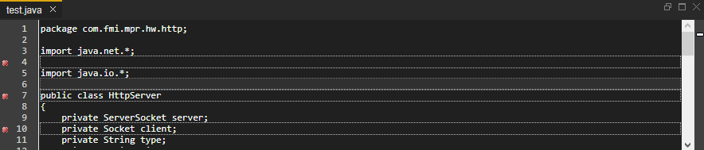
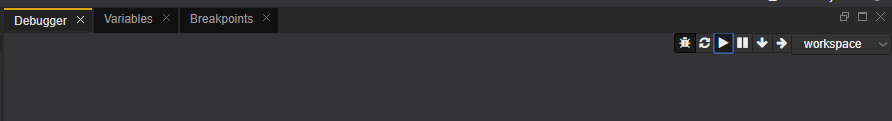
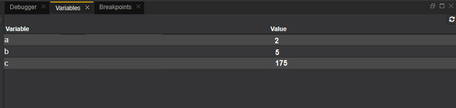
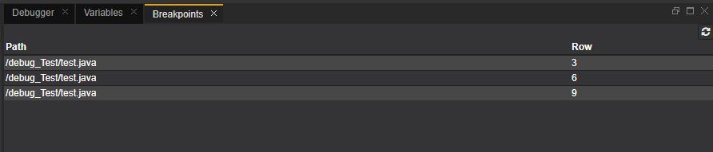
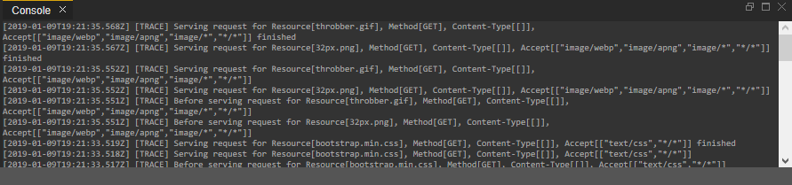
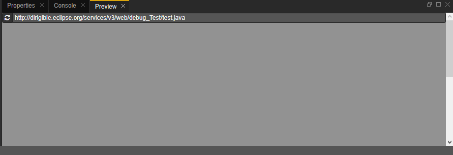

# Using the Debugger Perspective in Eclipse Dirigible
In this documentation you will learn how to use the Debugger in Eclipse Dirigible online platform

**Prerequisites**
You should open http://dirigible.eclipse.org opened, log in and load an existing non-empty project

## Content
  - The Debugger Perspective as an Eclipse Dirigible tool
  - Initial steps for using a debbuger
  - Types of views in the Debugger Perspective

### The Debugger Perspective as an Eclipse Dirigible tool
The Web IDE includes a Debugger perspective which is comprised of the following views:
 - Debugger
 - Variables
 - Breakpoints
 - Console
 - Preview
The Debugger perspective enables you to monitor the execution of your code, stop it, restart it or set breakpoints, and change values in memory.

### Initial Steps
 1. In the *Workspace* section, choose your project name and then the file you want to debug.
 2. To create breakpoints, double-click on the left numbered side.

 3. You can see the selected breakpoints in the *Breakpoints* section view. 
 4. To start the Debugger, in the *Debbuger* section  select the debbuger icon. To go through the breakpoints, select the single arrow.
 5. You can pause the execution, start it again and step into and step back with the icons in the *Debbuger* section.
 5. In the *Console* section you can view the code execution.
 6. To start a new debugging session, refresh in the *Preview* section and start again the process.
 ### Types of views in the Debugger Perspective
#### Debugger View
The Debugger view enables you to navigate the debugging of your code: to start it, pause it, restart it or proceed step by step.

#### Variables View
The Variables view displays the defined values of the variables when the code is executed. During the debugging process they may be displayed step by step or all at once, depending on the existing breakpoints.

#### Breakpoints view
The Breakpoints view enables you to follow the breakpoints you have created in the course of the debugging process. The first column of the view displays the path to the file in the document repository and the second one - the row where the breakpoint is situated.
Dillinger requires 

#### Console View
The Console view is a major debugging tool. It displays the output of the code that you are executing.

#### Preview view
The Preview view displays the result of executing the selected file. It refreshes automatically during Workspace change events e.g. Save.

## References
 - http://www.dirigible.io/help/

