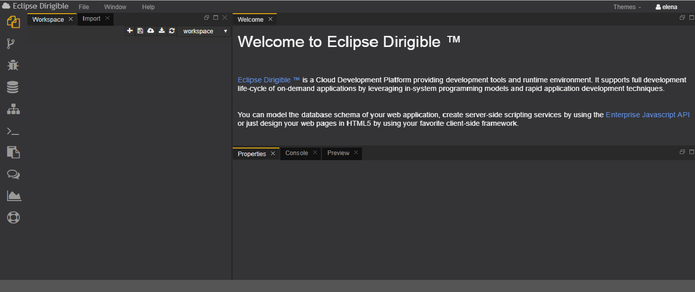
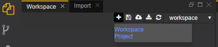

# Workbench Perspective
This is the place where the user develops the dynamic applications. This perspective contains all views and editors that may help in the overall implementation, from domain models via services to the user interface.

The Workbench perspective consists of:
- ###	Workspace
This is the place where the developer can create files that belong to some project and manage them. Each project can have one or more folders or files. The user has the option to create a various set of projects or to create different workspaces. By using the workspace view the developer can control the workspaces and jump from one workspace to another.

The IDE supports multiple editors registered for different file types. The developer can easily see the structure of the folder with the files in it  as we see from the picture below.

- ###	Import
The import section allows the user to upload files of different formats or zip files containing one or more projects in the workspace.  There is a bar which shows the process of uploading  the selected files.

- ###	Properties
In this section the user can see information (name,  path, type and content) for the file  they have chosen.

- ###	Console
The console is a debugging tool. It  shows the output of the code the developer is executing. It has several  log levels INFO,  WARNING, ERROR, TRACE. 

- ###	Preview
The preview view shows the result from executing the chosen file. It refreshes everytime an event occurs in the workspace.

