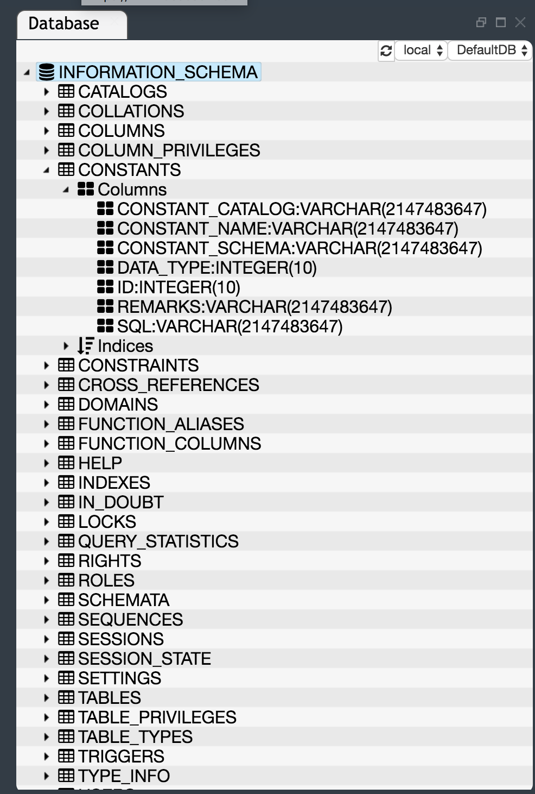

# Database Perspective

The Database perspective contains tools for inspection and manipulation of the artifacts within the underlying relational database. It is comprised of **Database view**, **SQL view**, **Console view** and **Result view**. 

## Database view

When you first open the view you are provided with incoming default schema linked yo your account. The view gives you easy access to all the tables, view, triggers and other components related to a database schema. You can easily exapnd the menu to see any information you need about a single database component. For an example on the picture here you can see the columns (name, type) in table **CONSTANTS** in **INFORMATION_SCHEMA**.

## SQL view

As you know to access data in RDSMS you need to use SQL ( Structed query language). You can use the provided SQL view to write quaries.
The view looks like simple text editor where you just put the query and execute it.

## Result view

To see the results from your query, Eclipse Derigable Database Perspective gives you the **Result view**. It gives you the results like table. If there are no results the view returns just *"No results"* message. If your query is wrong you get the error message in the view.

## Console view

The Console view is a major debugging tool. It displays the output that the execution of the code returned. With this tool, if your query returns an answer different from what you were expecting, you can follow what the debugger called(as function) while executing the code and find your mistake. Also, if your code gives an error, you can easily see where exactly the error is.

