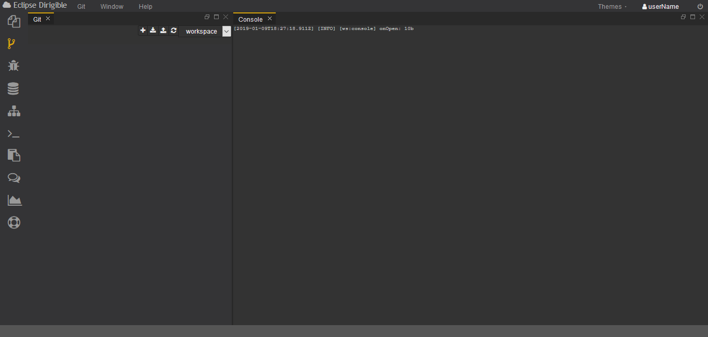
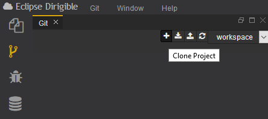
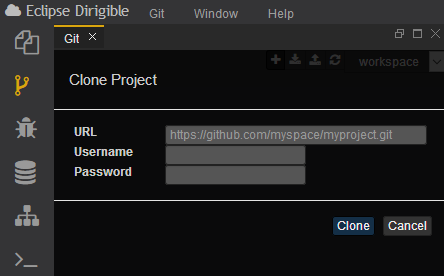
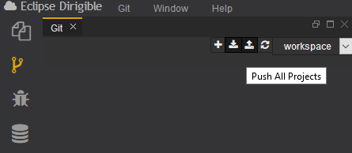
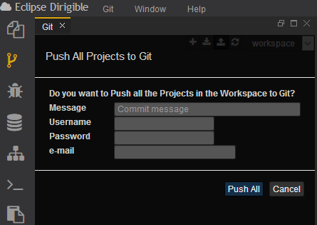
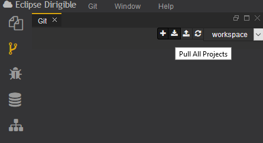
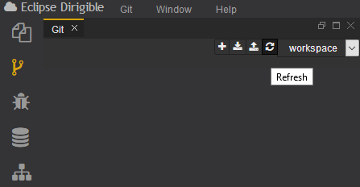
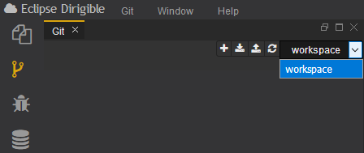

## Git perspective ##
The front-facing Web IDE component is a collection of plugins for project management, source code editing, modeling, SCM integration, database management and many more. One important perspective of the WEB IDE is the **Git perspective**

The **Git perspective** aims at presenting a simplified interface for the most common git operations. It is built from tools that support **Git** client operations. Here is a [link](https://confluence.atlassian.com/bitbucketserver/basic-git-commands-776639767.html) with the most basic **Git** commands, if you have no experience with it. 
## ##

The **Git perspective** is comprised of **Git** and **Console views** and **Workspace menu**. It enables the users to perform simple git operations such as cloning a repository to a workspace, pulling changes, and pushing commits. The user can create, manage, and switch between multiple workspaces through the Workspace menu.

## GIT ##
This is the Eclipse Dirigible window when **Git** is open. On the right side there is a console window. This is the **Console View** for **Git**. It is a debugging tool that displays the output of the code.

Right next to the console is the **Workspace menu**. There you can choose a particular operation.

## Clone project  #
By choosing **Clone Project** operation the user can clone a project to the current workspace.

## Push all projects  #
On the menu there is an option to perform an operation on all files.
By choosing **Push All Projects** you can push all of your files at once, from the current workspace to a remote repository.

## Pull all projects  #
Also, by choosing **Pull All Projects** you can pull all of your files from remote repository to the current workspace.

## Refresh the current workspace  #

If you want, you can easily **refresh** the current workspace.

## Change workspaces 

You can **change** the **workspace**, if you need to, from the menu next to the refresh button.

