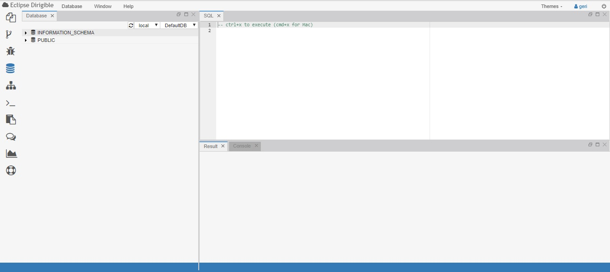
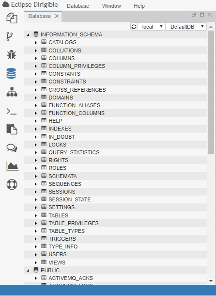
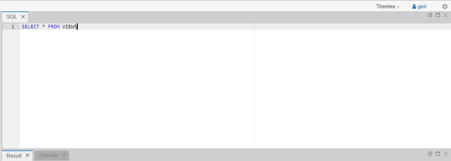
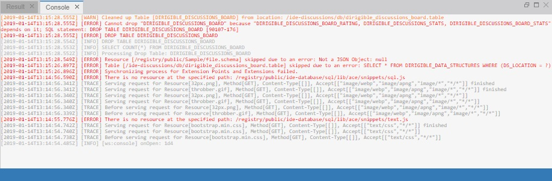
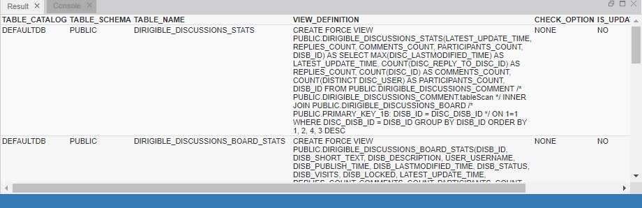

## Database Perspective in Eclipse Dirigible

The Database perspective contains tools for inspection and manipulation of the artifacts within the underlying relational database. The perspective contains Database, SQL, Console and Result views.

  

---
The Database view gives you direct access to the default target schema assigned to your account in the Web IDE. It enables you to expand the schema item and see the list of all tables and views created either via the data structures models or directly via SQL script.

 

---
The SQL view helps you to write a script to maintain with the schemas, create tables or request a queries.

---
In the Console view you execute the SQL scripts.

---
The result view illustrates the SQL script in a table format.

---
