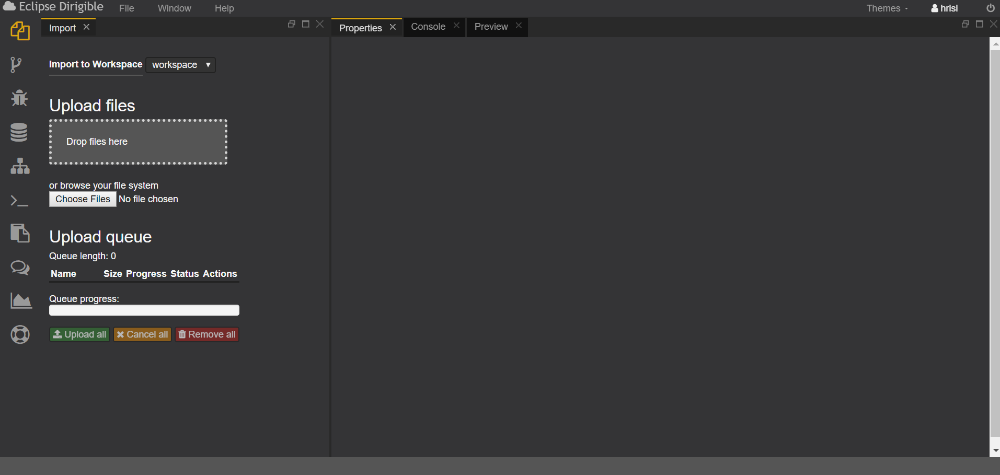
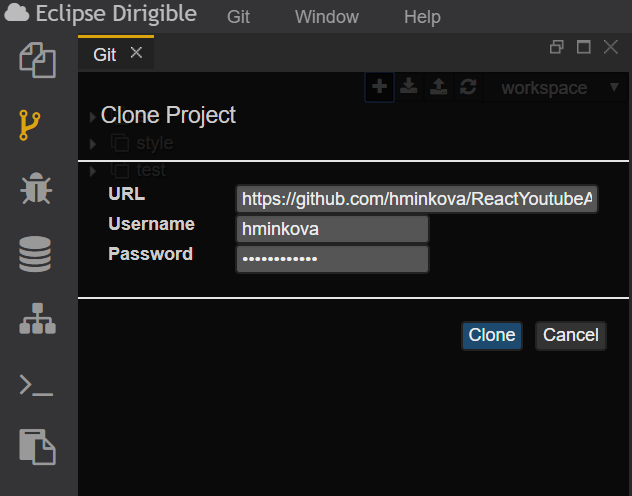
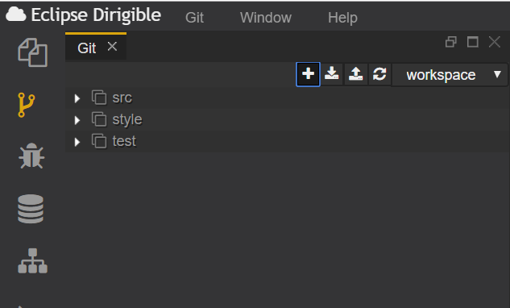
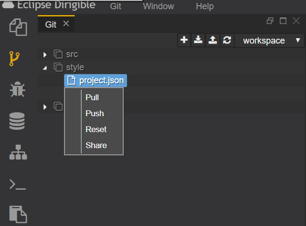
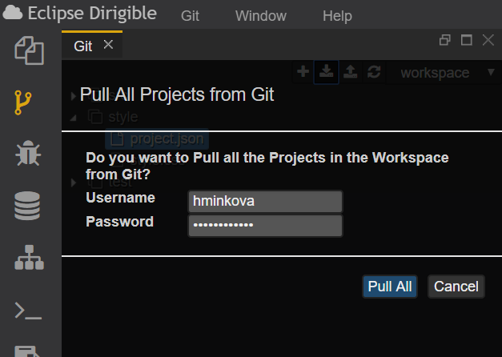
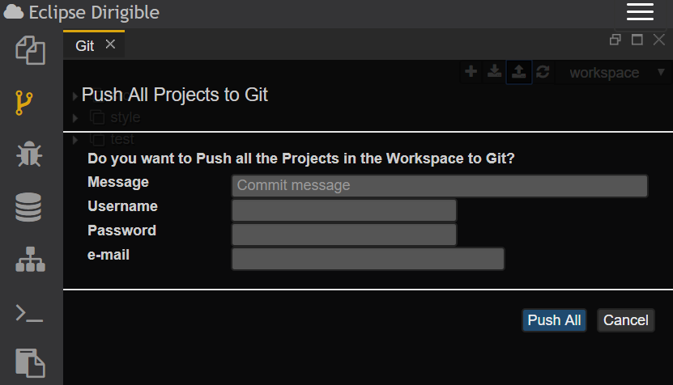

# Git Perspective
Git перспективата има за цел да предостави опростен интерфейс за най-често срещаните операции на git.

Разглеждаме конзола, Workspace менюто и самият Git, чрез който ще може да боравим с нашите репозиторита.

## Clone Project
Клонирането на проект се достъпва като от навигацията се избере бутона "+" от Git компонента.

След което трябва да се въведе:
- линк до желаното репозитори
- username 
- password 

След успешно свалено репозитори в конзолата ще излезе съобщение за успех и  ще видите всички налични файлове от изтегленото репозитори.

При клин на който и да е файл от сваленото репозитори може да се изпълняват следните команди:
- Pull
- Pushh
- Reset
- Share

## Pull All

Pull All командата служи за обновяване с последните версии на всички репозиротира от Workspace-а.

Поради верификация отново се изискват следните данни:
- Username
- Password

## Push All

Push All командата служи за качване на направените промени в Git. 

Поради верификация отново се изискват следните данни:
- Username
- Password
- Съобщение описващо направените промени който ще бъдат качени
- E-mail

## Merge Conflict

След изпълнение на командата push може да възникне конфликт между наличната версия в Workbench и GIT тогава може да си използва инстумента за сливането (merge) на двете конфликтни версии.
