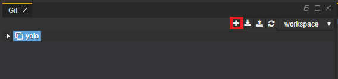
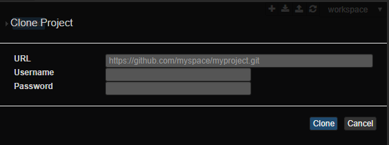
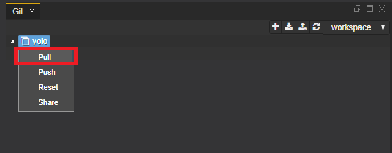
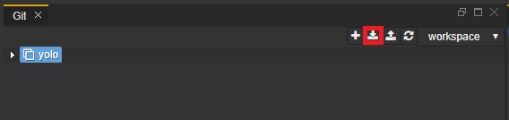
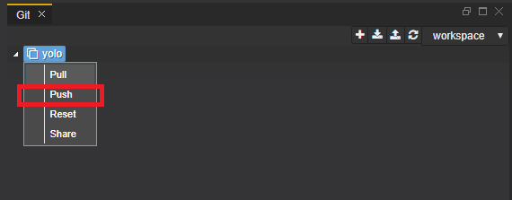
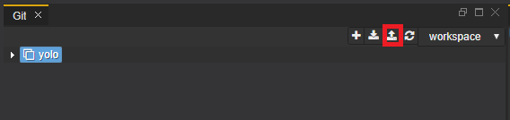
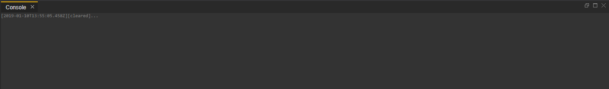

# Git Perspective

The Git perspective aims at presenting a simplified interface for the most common git operations. It is built from tools that support Git client operations

The Git perspective is comprised of Git and Console views and Workspace menu. It enables the users to perform simple git operations such as cloning a repository to a workspace, pulling changes, and pushing commits. The user can create, manage, and switch between multiple workspaces through the Workspace menu. 

## Git view

### Clone repository

You can clone a repository by clicking the "plus" icon.

You need to write the repository url as well as username and password for the repository in order to clone.

### Pull changes
You can choose to pull changes for a given project or to pull all projects.

To pull a given project right click on the project and select pull.

To pull all the project click the pull icon.

### Push commits
You can choose to push changes for a given project or to push all projects.

To push a given project right click on the project and select push.

To push all the project click the push icon.

> Note: In case of merge conflict on Push operation, a new branch with your local changes will be created in the remote repository. From this point you can use your preferred tooling to apply the actual merge between the two branches. 

## Console view

The console is read-only and gives you information about actions related to git such as errors, infos, warnings, date and hour of the information. From the console you can figure out if everything works well and we can get some feedback about our actions.

