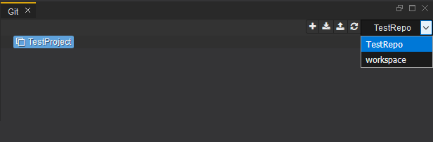
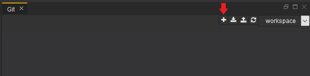
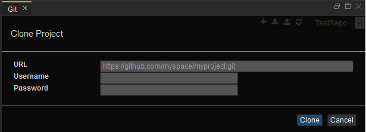
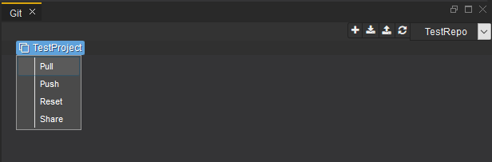
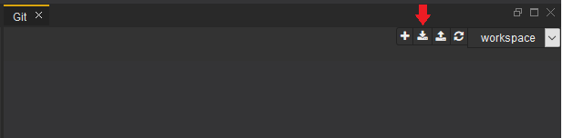
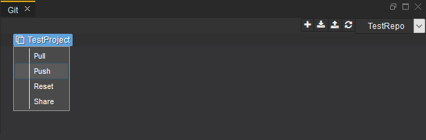
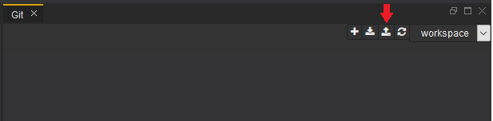
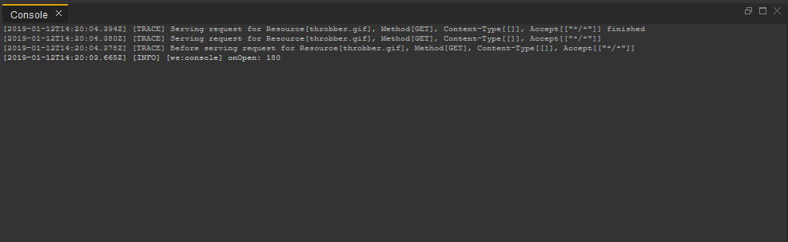

# Git Perspective

The Git perspective aims at presenting a simplified interface for the most common Git operations. It is built from tools that support Git client operations.

The Git perspective has three components:
  - Workspace menu - create and switch between different workspaces.
  - Git view - perform simple git operations such as cloning a repository to a workspace, pulling changes or pushing commits.
  - Console view - see the output of the different actions and get information about errors and warnings

## Workspace menu

You can select your Workspace from the dropdown menu.

## Git view

### Clone repository

To clone a repository, click the '+' icon.

You need to specify the URL of the repository and your Git credentials - username and password, in order to clone it.

### Pull changes

You can pull changes for a specific project or for all projects.

To pull a specific project, right click on the project and select "Pull" from the dropdown.

To pull all the projects, just click on the pull icon.

### Push commits

You can push changes for a specific project or for all projects.

To push a specific project, right click on the project and select "Push" from the dropdown.

To push all the projects, just click on the push icon.

> Note: In case of merge conflict on Push operation, a new branch with your local changes will be created in the remote repository. From this point you can use your preferred tooling to apply the actual merge between the two branches. 

## Console view

You can view the output of your actions in the the console. It provides Git-related information about errors, warnings, timestamps and other. The console is read-only and can be used to track your actions and if their results are correct.

