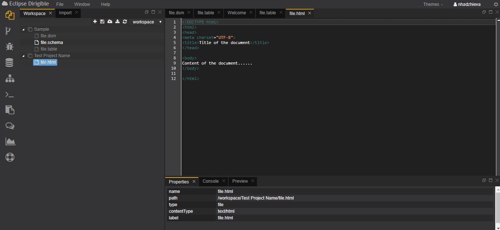
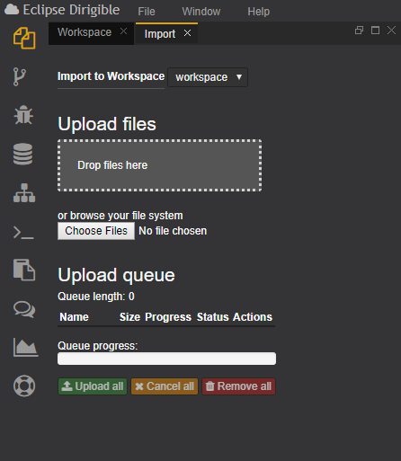
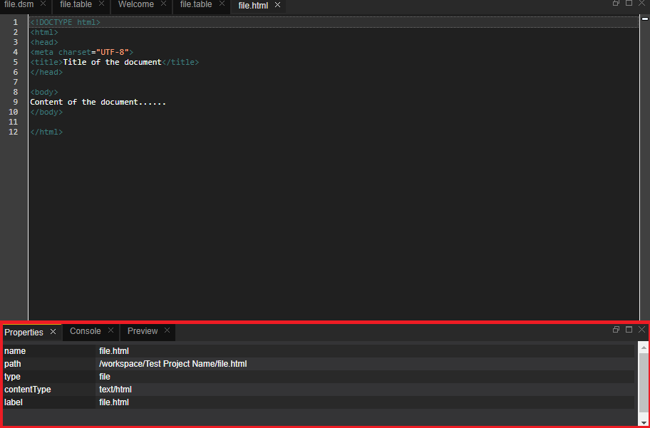
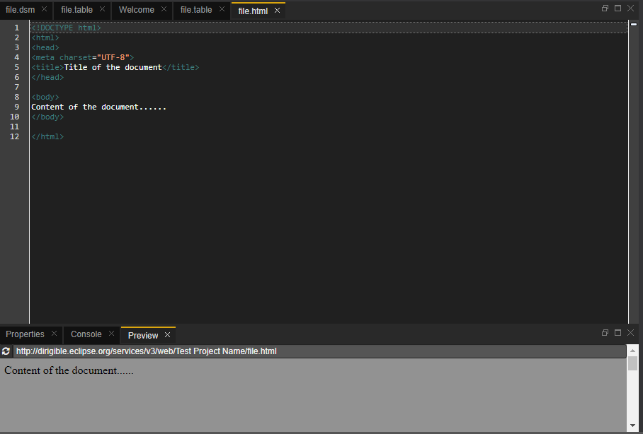
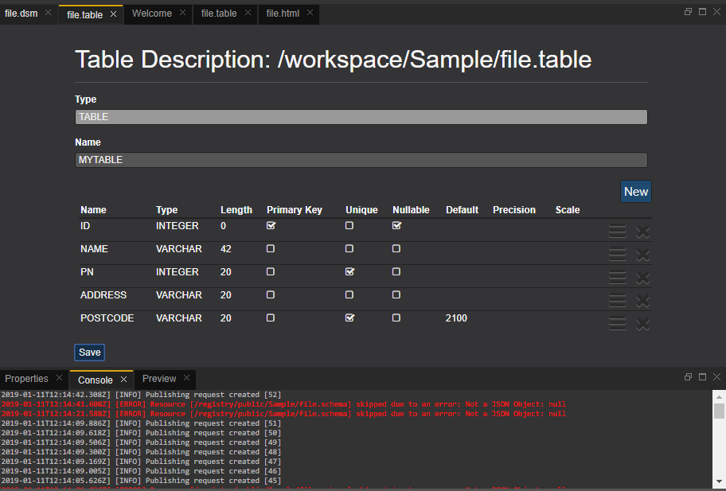

# Workbench Perspective
This is the place where the user develops the dynamic applications. This perspective contains all views and editors that may help in the overall implementation, from domain models via services to the user interface. Workbench ensures perspective for full support of project management (New, Cut, Copy, Paste, Delete, Refresh, Import, Export, etc.)

The **Workbench** perspective is comprised of:

 ### **Workspace**:
 The Workspace is the place where user creates and manages the application artifacts. Тhe concept of a Workspace is very similar to the well known workspace from desktop IDEs e.g. Eclipse. The workspace can hold one or more projects. One user can have multiple workspaces, but can work in one only at a given moment of time.

Each project can contain multiple folders and files. The projects file organization is agile and made with the preferences of the users. The Workspace explorer displays a standard view on the projects in user's workspace.The folder structure is shown with the files. More than one editor can be registered for one file type and in this case a “Open with…” context menu entry is rendered for the user to select, which one to use.

 ### **Import**:
 The Import view enables the user to upload a *.zip file, containing one or more projects, to the selected Workspace. The view includes a progress bar for navigation of the process. The user can manage and switch between multiple workspaces through the Workspace menu.
 
 ### **Properties**:
 After selecting a file, or folder in your workspace you can see The properties of selected file or folder are shown in  **Properties** window.
 
 ### **Preview**:
 The Preview view displays the result of executing the selected file. It refreshes automatically after Save. User can manualy refresh the view if is needed.
 
 ### **Console**:
 Console object is used to write messages to the default logging output. It has several log levels INFO, WARNING, ERROR, TRACE. The Console view is the debugging tool for the user. The user can track the output of the code there.
 
 