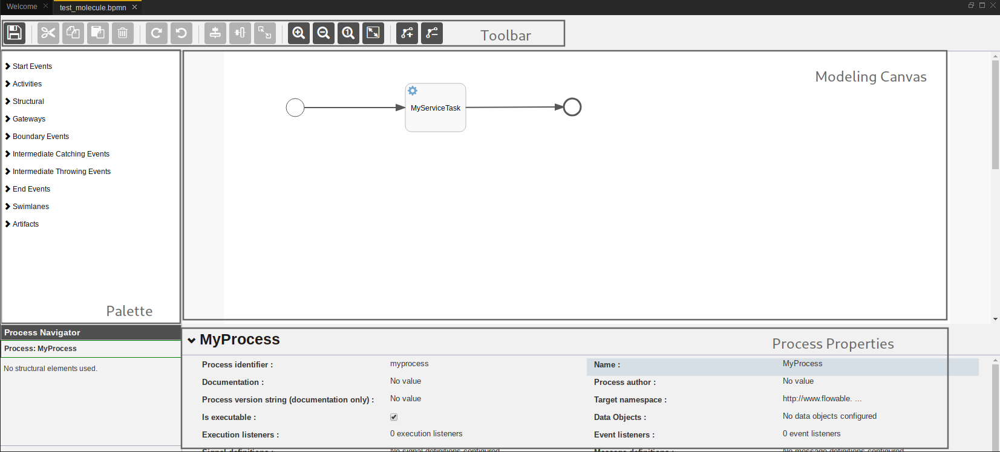
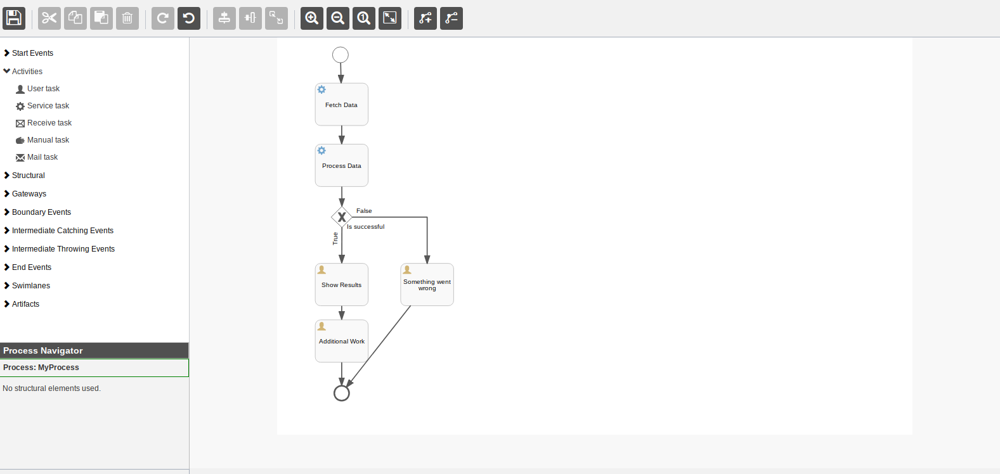
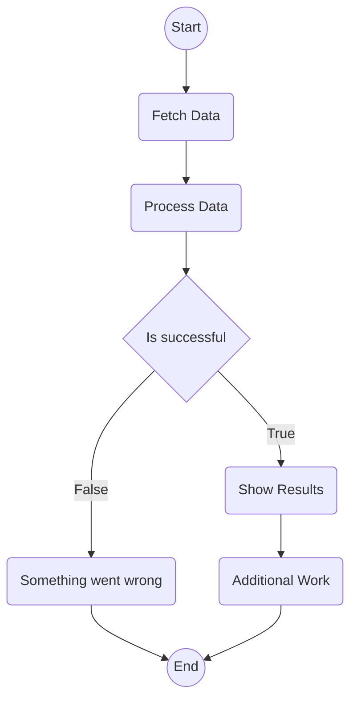

<h1 align="center">BPMN Modeler</h1>
<h5 align="center">Date: 2019-01-13_04-32-26</h5>
<h5 align="center">Author: npd</h5>


<center><a href="http://dirigible.io"></a></center>

<h2 align="center">Table of Contents</h2>

  * [Details and Options](#details)
  * [Examples](#details)
  * [Properties & Relations](#properties)
  * [Possible Issues](#issues)


<h2 id="details" align="center">Details and Options</h2>

The BPMN Modeler enables the visual design of business processes. It is built on top of the light-weight business process engine,
[*Flowable*][flowable], written in Java. The engine allows you to deploy BPMN 2.0 process specifications (an industry XML standard), create
process instances, run queries, accessing active or historical process instances and related data, etc.

<center></center>

The BPMN layout includes the following panels and their respective functions:

  * Palette - Palette of BPMN elements, used to design processes
  * Toolbar - Document actions, such as zoom, pan, and save.
  * Model Canvas - Your Business Process design canvas; you can also drag & drop BPMN elements from the Palette
  * Properties Panel - Properties of the main process model, if no element is selected; otherwise the properties of the selected
    BPMN element

<h2 id="examples" align="center">Examples</h2>

<details>
  <summary>Execution context</summary>

  Source: [Execution context][ex1]
  <p>

  1. Create a project **bpmn\_process\_project**
  2. Then create a JavaScript service named **my_delegate.js** with the following content:

```javascript
console.info("Hello from the JavaScript Delegate!");

let process = require('bpm/v3/process');
let execution = process.getExecutionContext();

process.setVariable(execution.getId(), 'variable2', 'value2');

try {
    console.info("variable1: " + process.getVariable(execution.getId(), 'variable1'));
    console.info("variable2: " + process.getVariable(execution.getId(), 'variable2'));
} catch(e) {
    console.error(e.message);
}
```

  3. Then create a Business Process Model (via the *New* popup menu) named **my_process.bpmn**
  4. Double-click on this file to open the corresponding BPMN editor.
  5. There should be shown on the diagram a *Start Event*, connected to a **MyServiceTask**, connected to an *End Event*.
  6. Select the **MyServiceTask**.
  7. In the *Properties* section below the diagram, find the *Class* fields property and click on it.
  8. In the *Class* fields dialog, find and click on the field **handler**.
  9. Change its value from **myproject/mydelegate.js** to **bpmn_process_project/my_delegate.js** and click *Save*.
  10. Click on the *Save* button on the top-left corner of the editor with *Name* - **MyProcess** and *Key* - **myprocess**
  11. Publish the project
  12. Then create a JavaScript service named **my_trigger.js** which will be used to start the just defined process

Enter the following code in it:

```javascript
let process = require('bpm/v3/process');
process.start('myprocess', {"variable1": "value1"});
```

  13. Select the **my_trigger.js** file in the *Workspace view* to be able to trigger the invocation of this service via the *Preview view*
  14. In the *Console view* you should see the following lines:

> [2018-05-14T14:25:16.791Z] [DEBUG] Done starting a BPMN process by key: myprocess
>
> [2018-05-14T14:25:16.773Z] [INFO] variable2: value2
>
> [2018-05-14T14:25:16.772Z] [INFO] variable1: value1
>
> [2018-05-14T14:25:16.751Z] [INFO] Hello from the JavaScript Delegate!
>
> [2018-05-14T14:25:16.585Z] [DEBUG] Starting a BPMN process by key: myprocess

  
  The log messages in the <i>Console view</i> are in a reverse order - the newest are on top

  </p>
</details>

<details id="transient-var">
  <summary>Transient Variables</summary>

  Adapted from: [Transient variables][ex2]

  Source (BPMN): [Test Molecule Business Process][exbp1]

  <p>
  Transient variables are variables that behave like regular variables, but are not persisted.
  Typically, transient variables are used for advanced use cases. When in doubt, use a regular process variable.

  Let’s assume the <i>Fetch Data</i> service task calls some remote service (for example, using REST).
  Let’s also assume some configuration parameters are needed and need to be provided when starting the process instance.
  Also, these configuration parameters are not important for historical audit purposes, so we pass them as transient variables:

```javascript
let processInstance = runtimeService.createProcessInstanceBuilder()
       .processDefinitionKey("someKey")
       .transientVariable("configParam01", "A")
       .transientVariable("configParam02", "B")
       .transientVariable("configParam03", "C")
       .start();
```

Note that the transient variables will be available until the user task is reached and persisted to the database.
For example, in the <i>Additional Work</i> user task they are no longer available. Also note that if <i>Fetch Data</i> had been asynchronous, they wouldn’t be available after that step either.
  </p>
</details>

<h2 id="properties" align="center">Properties & Relations</h2>

You can easily render your BPs using [Mermaid][mermaid] in the browser.
Starting from

<center></center>

and translating the [Transient variables](#transient-var) BPMN to [Mermaid][mermaid] flowchart, we end up with the following diagram:



<h2 id="issues" align="center">Possible Issues</h2>

<h2 id="refs" align="center">References</h2>

* [Dirigible BPMN Modeler][dirigible_bpmn]
* [Dirigible BPMN Process][ex1]
* [Flowable BPMN Engine][flowable_docs]
* [Mermaid Flowcharts][mermaid_flowchart]

> Copyright © 2010-2018 Eclipse Foundation, Inc. All Rights Reserved. Eclipse is a registered trademark of the Eclipse Foundation, Inc. Dirigible is a trademark of the Eclipse Foundation, Inc.

[//]: # (These are reference links used in the body of this note and get stripped out when the markdown processor does its job. There is no need to format nicely because it shouldn't be seen. Thanks SO - http://stackoverflow.com/questions/4823468/store-comments-in-markdown-syntax)


   [flowable]: <https://www.flowable.org>
   [flowable_docs]: <https://www.flowable.org/docs/userguide/index.html>
   [epl]: <https://www.eclipse.org/legal/epl-v10.html>
   [ex1]: <http://www.dirigible.io/samples/complex_process_console.html>
   [ex2]: <https://www.flowable.org/docs/userguide/index.html#apiTransientVariables>
   [exbp1]: <res/test_molecule.bpmn>
   [mermaid]: <https://mermaidjs.github.io>
   [mermaid_flowchart]: <https://mermaidjs.github.io/flowchart.html>
   [dirigible_bpmn]: <http://www.dirigible.io/help/ide_modeler_bpmn.html>
