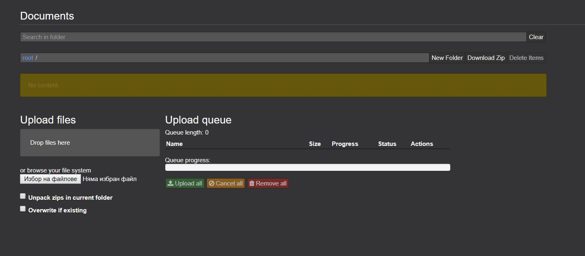
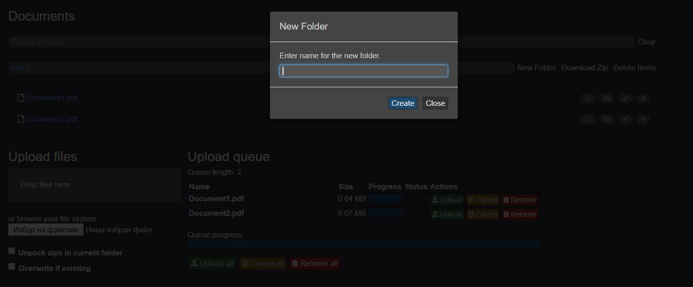
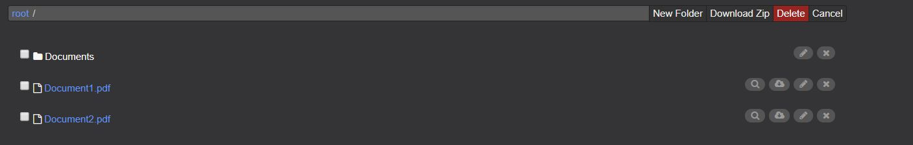
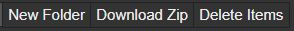
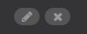
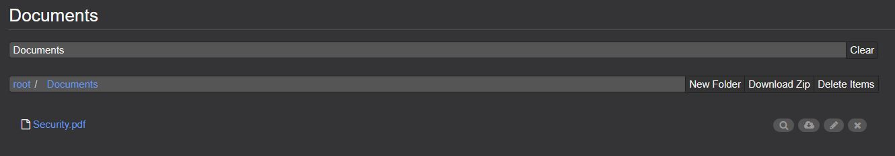
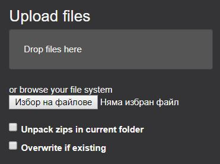
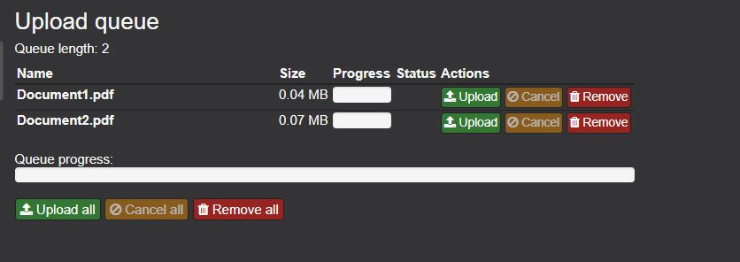

# Documents Perspective
---
The Documents perspective is the place where the user manages the binary artifacts such as pictures, 
spreadsheets, PDF files, etc. It enables him/her to upload, overwrite, download, delete and search for artifacts.

## Views
---
At the moment the Documents perspective consists of only one view, which is also called Documents.

### Options
---

In the "Search in folder" field you can type in the folder's name to find it. There is also a "Clear" button that clears the field. If the folder exists then it is shown and you can select it in order to view the foder files.

---
The next field shows the current folder and gives the opportunity to go back in the folder/s that are higher in the hierarchy.
There are some buttons that give the following options:
 - New Folder - to create a new folder in the one you are in.
 
 - Download Zip - to zip and download everything in the current folder
 - Delete Items - to delete all or some of the items in the current folder
 Once selecting this button checkboxes appear in front of every file/folder and additional button - "Cancel" to cancel the delete process.
 To delete a file just click the corresponding checkbox and click the "Delete" button which appears in red.
  
 You can choose the desired option by clicking the corresponding button 
---
**Folder options** - for every folder there are the following options:  
 - Rename - it gives the opportunity to rename the folder 
 - Delete - it gives the opportunity to delete the folder
You can choose the desired option by clicking the corresponding button 

**File options** - for every file there are the following options: 
 - Preview - it gives the opportunity to preview the file
 - Download - it gives the opportunity to download the file
 - Rename - it gives the opportunity to rename the file
 - Delete - it gives the opportunity to  delete the file
You can choose the desired option by clicking the corresponding button 

## Upload Files
In this section you can upload files in the folder that you are in.
There are two different ways to upload the file/s. 
You can drag and drop them in the specified section - "Drop files here" or 
you can browse your file system by clicking the "Browse" button and then choosing the desired file/s.
Either way the file/s must appear in the "Upload Queue" section.
There are two additional options too, presented by checkboxes:
 - Unpack zips in current folder - if you want to unzip archives on upload tou can click on the corresponding checkbox
 - Overwrite if existing - you can choose it by clicking the checkbox
 

## Upload Queue
This section presents the uploading progress.
It shows the queue length - how many files are there.
It also shows the document's information - its name, size, progres,  status and gives some quick options: Upload/ Cancel/ Remove.
 - Upload - it gives the opportunity to upload just this file.
 - Cancel - it gives the opportunity to cancel the uploading of this file if it has not finished.
 - Remove  - it gives the opportunity to remove this file from the queue
There are also the following buttons:
 - Upload all - by clicking this button you can upload all the files in the queue.
 - Cancel all - by clicking this button you can cancel all the files int the queue if the uploading has not finished yet.
 - Remove all - by clicking this button you can remove all the files in the queue.
 
 
 
 
 