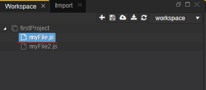
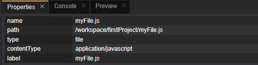

# Workbench Perspective
 This is the place where the user develops the dynamic applications. This perspective 
contains all views and editors that may help in the overall implementation, from domain models via services to the user interface.

The Workbench perspective is comprised of Workspace, Import, Properties, Console and Preview views, plus the editors registered for each
file type. In other words, the minimal toolset for file management, preview and editing operations.  
The main view opened by default in this perspective is the Workspace explorer, a standard view on the projects in your workspace.

## Views
### 1. Workspace  
As already mentioned this view is opened by default.  
The Workspace is the place where the developer creates and manages the application files. It contains of projects. Each project can have folders
and files. Here the developer can change or create files or folders, as well as different projects.
Various workspaces can be created and the user can switch between them.
  

  
The developer can also:
  - create a new project or workspace
  - save all
  - publish all
  - export all
  - refresh project
  - change workspace
  
The IDE supports different editors and different types of files. The developer can easily see the structure of the folder and the containing
files.
  
 
  
### 2. Import
This is the place where the user can upload a .zip file, which contains of one or more projects, to the selected workspace. There is a bar,
showing the uploading process.
 

 
### 3. Properties
In Properties view the developer can see some information about the files in the projects, e.g. name, path, type...  

### 4. Console  
A debugging tool, showing the output of the executed code. It has several log levels (Info, warning, error)

### 5. Preview  
This view shows the result of the execution of selected file. It refreshes automatically, when an event in the workspace occurs

 
  
