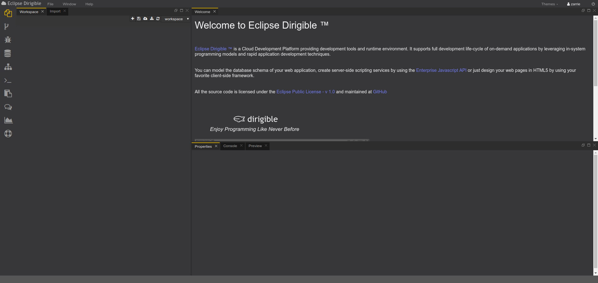
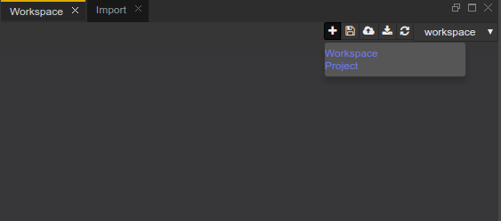
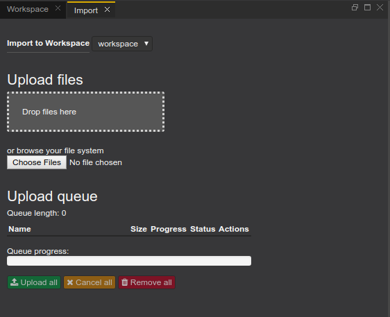
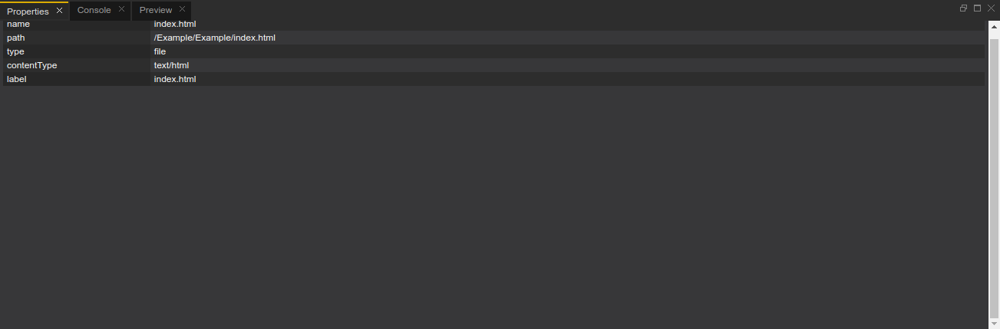
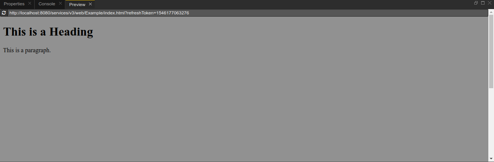

# Workbench Perspective
This is the place where the user develops the dynamic applications. This perspective contains all views and editors that may help in the overall implementation, from domain models via services to the user interface.

### The Workbench perspective is comprised of:

 - **Workspace**:
 The Workspace is the developer’s place where he/she creates and manages the application artifacts. The first-level citizens of the _workspace_ are the _projects_. Version 3 of Dirigible enables the users to create, manage, and switch between multiple workspaces through the Workspace view. 

 

 
 
 

  Each project can contain multiple folders and files (artifacts). The new template-based project and artifacts scaffolding generators features are worthy of mention. The projects file organization is now non-normative and entirely up-to the preferences of the users. The IDE supports multiple editors registered for different file (MIME) types. More than one editor can be registered for one file type and in this case a “Open with…” context menu entry is rendered for the user to select, which one to use.
  The Workspace explorer displays a standard view on the projects in your workspace. It shows the folder structure along with the files.

  

  
  
  

  There is also a context menu assigned to the project node:

  

  
  
  

  - **Import**:
  The Import view enables the user to upload a *.zip file, containing one or more projects, to the selected Workspace. The view includes a progress bar for navigation of the process. The user can manage and switch between multiple workspaces through the Workspace menu.

  

  
  
  

  - **Properties**:
  After selecting a file, or folder in your workspace you can see it's properties and information about the target in the 'Properties' window.

  

  
  
  

  - **Console**:
  Console object is used to write messages to the default logging output. It has several log levels INFO, WARNING, ERROR, TRACE. The Console view is a major debugging tool. It displays the output of the code that you are executing.

  

  
  
  

  - **Preview**:
  The Preview view displays the result of executing the selected file. It refreshes automatically during Workspace change events e.g. Save.

  

  
  
  

