# Git Perspective
## Introduction

  The Git perspective aims at presenting a simplified interface for the most common Git operations. It is built from tools that support Git client operations.

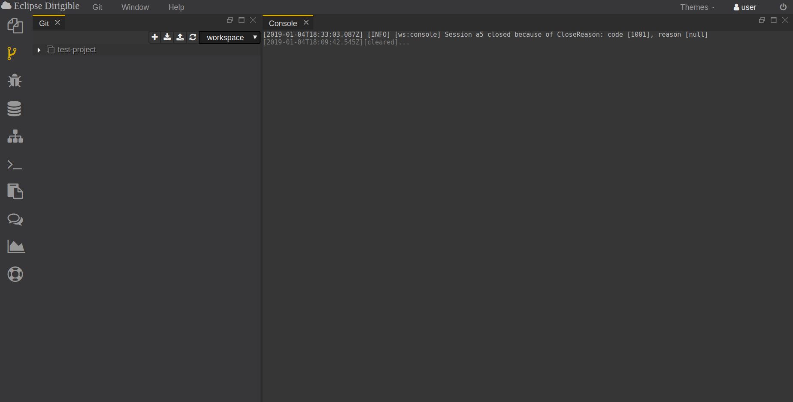

  The Git perspective is comprised of Git and Console views and Workspace menu. It enables the users to perform simple Git operations such as cloning a repository to a workspace, pulling changes, and pushing commits. The user can create, manage, and switch between multiple workspaces through the Workspace menu.
   
  *Note*: In case of merge conflict on Push operation, a new branch with your local changes will be created in the remote repository. From this point you can use your preferred tooling to apply the actual merge between the two branches.

## Functionalities
### 1. How to change workspace ?

  Workspaces help you to organize and manage your projects with ease.
   
  You can change the workspace by opening the drop-down menu which is located at the top of the screen and selecting the wanted workspace.

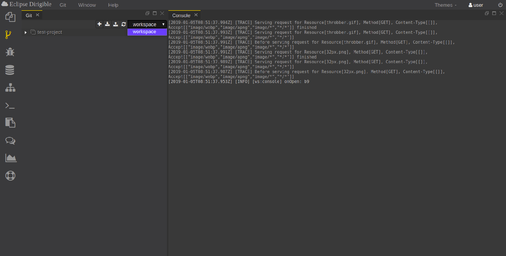

  In the image above there is only one workspace named **workspace**.

### 2. How to clone project ?

  You can clone project from a repository into your workspace by selecting the button 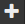 located at the top of the screen.
   
  A view containing three fields appear on left after selecting the button.
   
   
  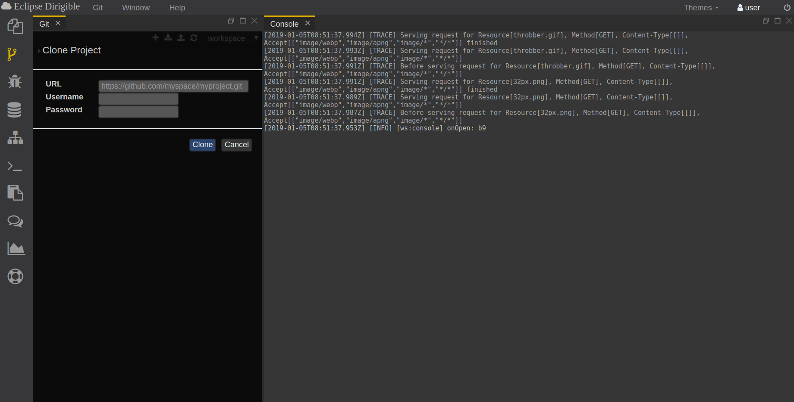
   
   
  In the first field (**URL**) you should write the URL of the project that you want to clone. Second field (**Username**) is for the username and third field (**Password**) is for the password for the account in the specific implementation of the Git version control system where the project is located.
   
  After you have filled in the blank fields to clone the project select the button *Clone*. To cancel the cloning procedure select the button *Cancel*.

### 3. How to pull all projects ?

  You can pull all the projects from Github (or other implementation of the Git version control system, for example Gitlab) account by selecting the button 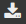 located at the top of the screen and entering your credentials.
   
  A view containing two fields appear on left after selecting the button.
   
   
  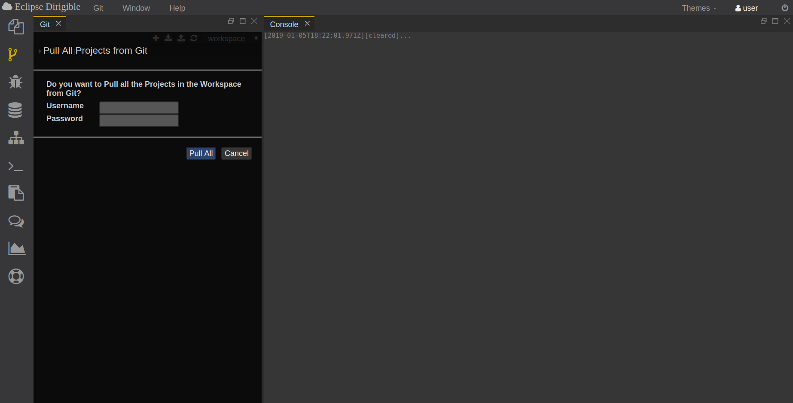
   
   
  First field (**Username**) is for the username and second field (**Password**) is for the password for the account in the specific implementation of the Git version control system from where you pull all projects.
   
  After you have filled in the blank fields to pull all the projects select the button *Pull All*. To cancel the pulling procedure select the button *Cancel*.

### 4. How to push all projects ?

  You can push all the projects to Github (or other implementation of the Git version control system, for example Gitlab) account by selecting the button  located at the top of the screen.
   
  A view containing four fields appear on left after selecting the button.
   
   
  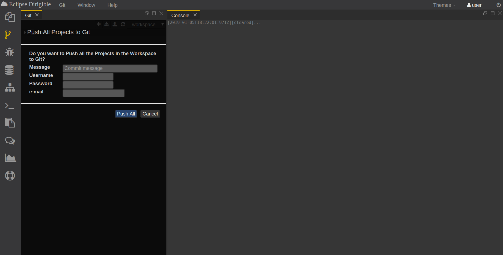
   
   
  First field (**Message**) is for the commit message. Second field (**Username**) is for the username and third field (**Password**) is for the password for the account in the specific implementation of the Git version control system where you push all the projects. In the fourth field (**e-mail**) you should write your email address.
   
  After you have filled in the blank fields to push all the projects select the button *Push All*. To cancel the pushing procedure select the button *Cancel*.

### 5. How to refresh the workspace ?

  You can refresh the workspace by selecting the button 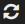 located at the top of the screen.

### 6. How to pull a specific project ?

  You can pull a specific project from Git by selecting it from the workspace with right click and then choose the option *Pull* from the drop-down menu.
   
   
  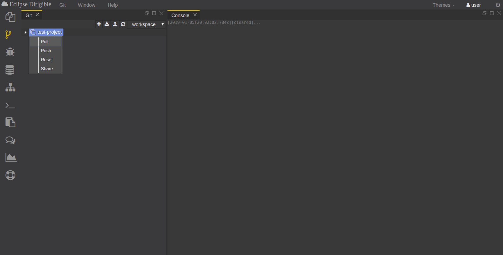
   
   
  A view appears on left which is similar to the view that appears when selecting the button  (*Pull All Projects* button).
   
   
  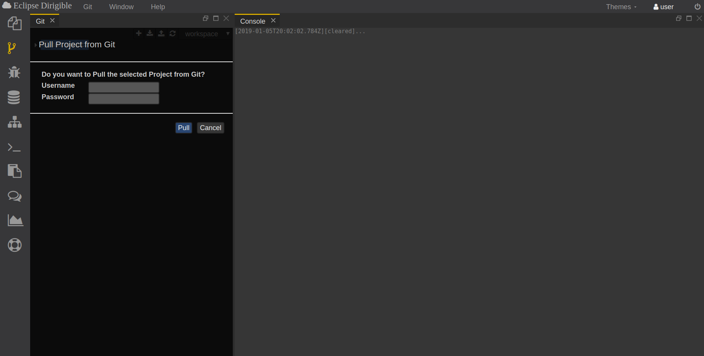

### 7. How to push a specific project ?

  You can push a specific project to Git by selecting it from the workspace with right click and then choose the option *Push* from the drop-down menu.
   
   
  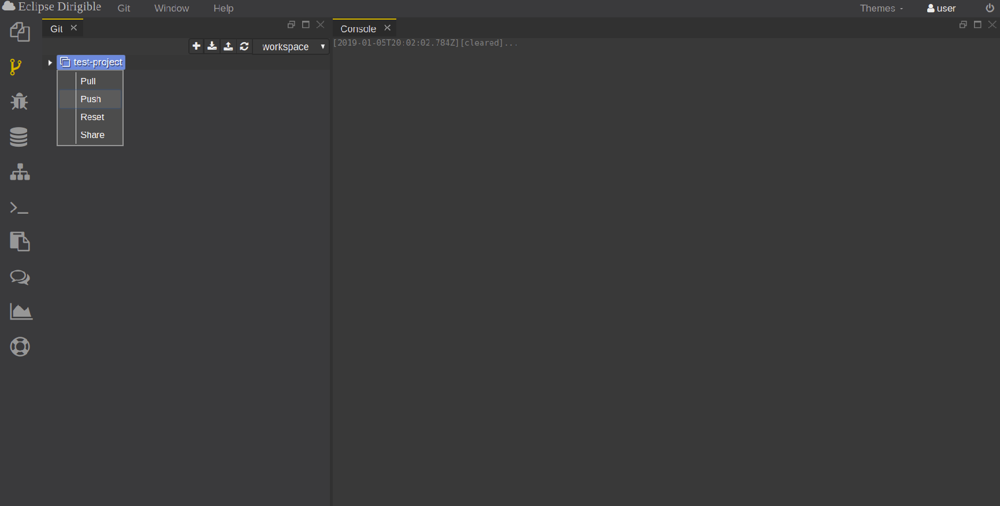
   
   
  A view appears on left which is similar to the view that appears when selecting the button  (*Push All Projects* button).
   
   
  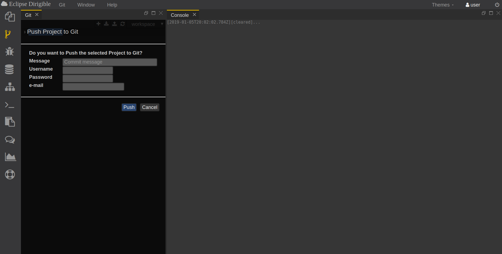

### 8. How to reset a specific project from Git ?

  You can reset a specific project from Git by selecting it from the workspace with right click and then choose the option *Reset* from the drop-down menu.
   
   
  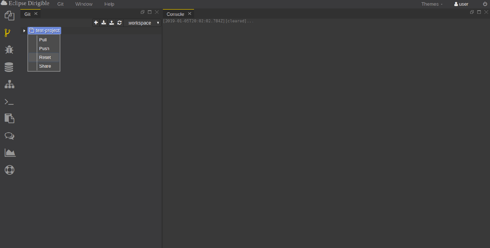
   
   
  A view appears on left containing three fields: **Message**, **Username** and **Password**.
   
   
  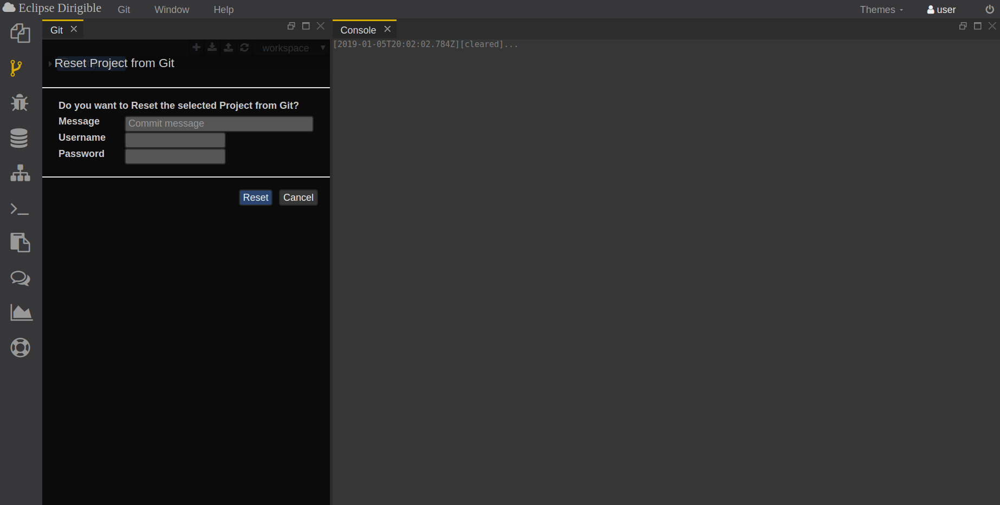

### 9. How to share a specific project to Git ?

  You can share a specific project to Git by selecting it from the workspace with right click and then choose the option *Share* from the drop-down menu.
   
   
  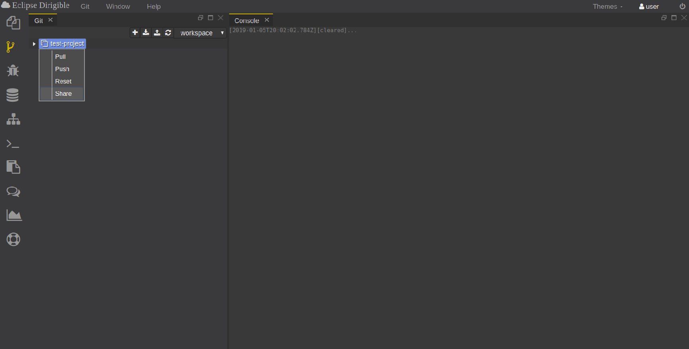
   
   
  A view appears on left containing six fields: **Repository**, **Branch**, **Message**, **Username**, **Password** and **e-mail**.
   
   
  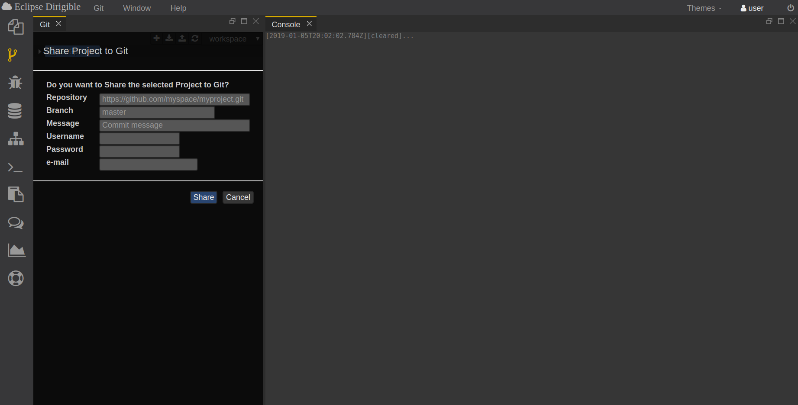

### 10. How to see underlying commands which are executed when performing a Git operation ?

  You can see what commands are used when executing a Git operation in the Console view. This can help you fix problems which arise from improper use of some of the git operations.
   
   
  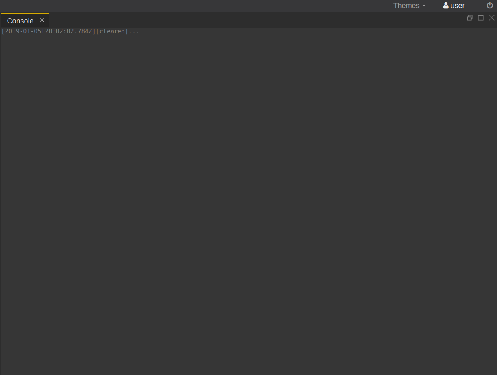

