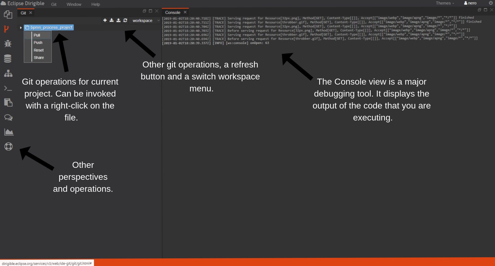
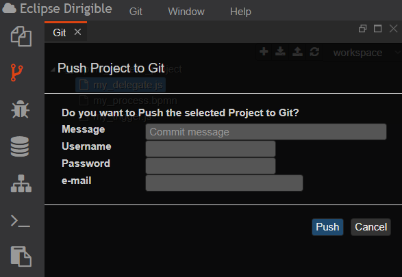

<h1 align="center">Git Perspective</h1>

The Git perspective aims at presenting a simplified interface for the most common git operations. It is built from tools that support Git client operations. If the user does not have any exprience with Git then the following [link](https://rubygarage.org/blog/most-basic-git-commands-with-examples) gives a good explanation what is Git and the basic usage.

The Git perspective is comprised of **Git** and **Console views** and **Workspace menu**. It enables the users to perform simple git operations such as cloning a repository to a workspace, pulling changes, and pushing commits. The user can create, manage, and switch between multiple workspaces through the Workspace menu.

In order to execute a command on a single file or folder, the user must select it and right-click to expand the menu. When executing a command, the user will be asked each time for the author name and email address to be used with the commits.

The Pull command fetchs and merges changes on the remote repository to the workspace.

The Push command sends local commits to the remote repository. In case of merge conflict on Push operation, a new branch with the local changes will be created in the remote repository. From that point the user can use a preferred tooling to apply the actual merge between the two branches.

The Reset command will undo the users most recent commit and put those changes back into staging, so the user does not lose any work.

The Share command lets the user share the file or project to a specific branch in a remote repository (both branch and repository are specified).

In the lower menu the user has the option to perform operation on all the files in the current workspace. Push all projects or Pull all projects. The data required to execute these commands are similar to the previous commands where only one file is effected.

The user can also clone a repository to the current workspace.

