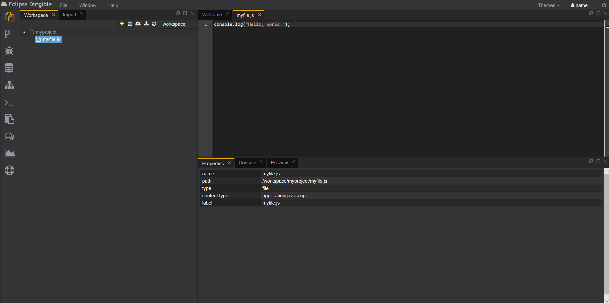
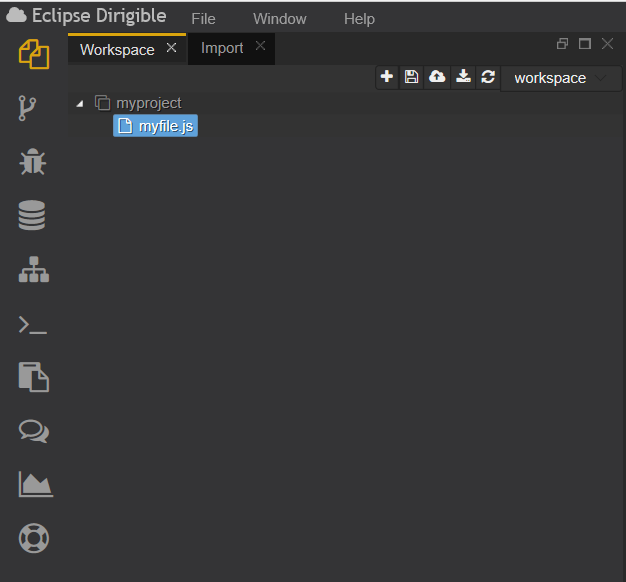
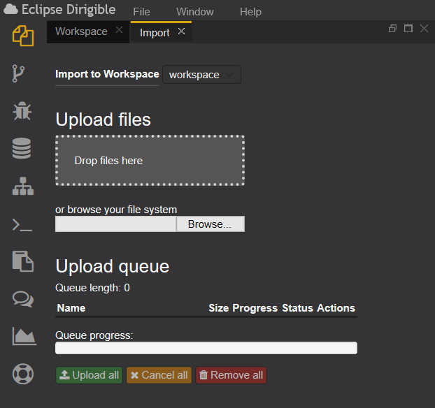
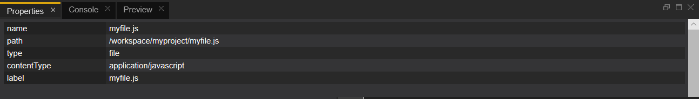
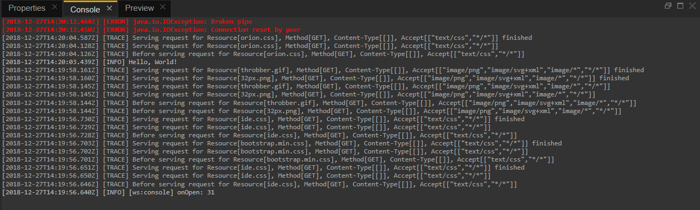
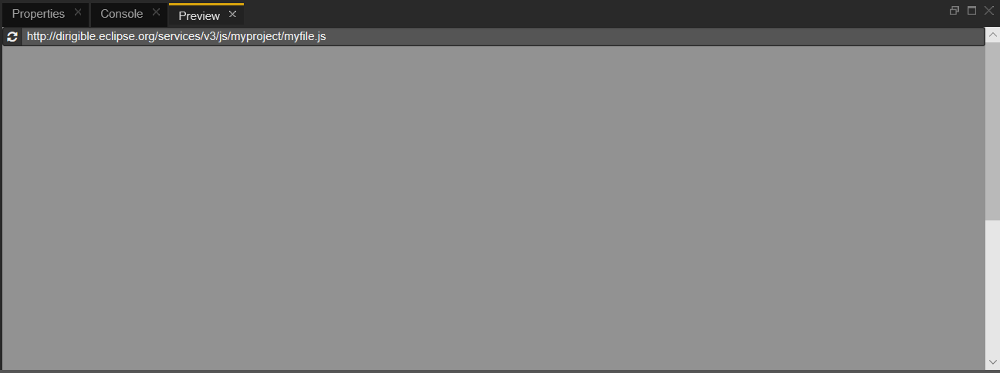

# Workbench Perspective
This is the place where the user develops the dynamic applications. This perspective contains all views and editors that may help in the overall implementation, from domain models via services to the user interface.
The Workbench perspective is comprised of **Workspace**, **Import**, **Properties**, **Console** and **Preview** views, plus the editors registered for each file type. In other words, the minimal toolset for file management, preview and editing operations.
The *main view opened by default* in this perspective is the Workspace explorer, a standard view on the projects in your workspace.

### The Workbench perspective consists of:

**Workspace view*
Workspace is the developer's place where he/she creates and manages the files of the application and projects. Each project can contain multiple folders and files. A user can have multiple workspaces containing a different set of projects. There is a new template-based project and files scaffolding generators features in Version 3 of Dirigible. The projects file organization is non-normative and entirely up-to the preferences of the users. The IDE supports multiple editors registered for different file types. The Workspace explorer displays a standard view on the projects in your workspace. It shows the folder structure along with the files. There is also a context menu assigned to the project node from where the user can creare a new folder, file or whatever he/she wants, to rename it, delete it and so on.

**Import view*
The Import section allows the user to upload a file with any extension or even a *.zip file, containing one or more projects in the selected workspace. The view includes a bar that shows the file upload process in the workspace. The user can manage and switch between several workspaces through the Workspace menu.

**Properties view*
In the properties section the user can see the chosen by him *name*, *path*, *type*, and the *content* of a file.

**Console view*
The console is a major debugging tool. It shows the output of the code the user is executing. Also the console object is used to write messages to the default logging output. It has several log levels *INFO*, *WARNING*, *ERROR*, *TRACE*. 

**Preview view*
The Preview section shows the result of the selected file. It refreshes automatically when an event occurs in the workspace, for example if the user saves the project.

