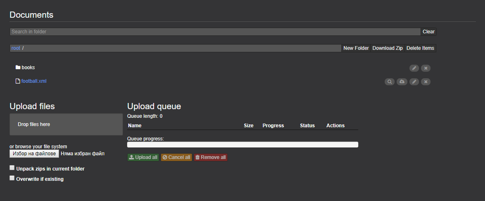
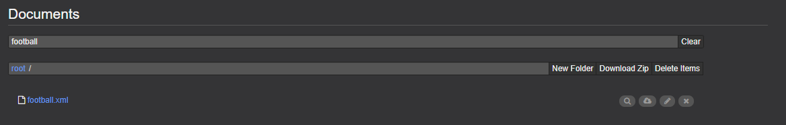
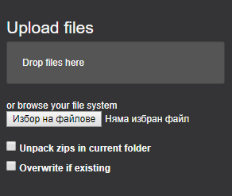
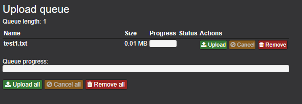
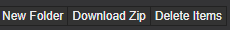
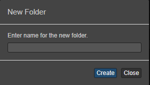
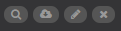
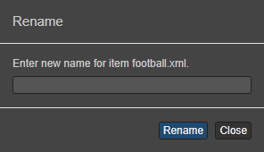
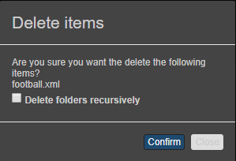

# Documents Perspective
Eclipse Dirigible ™ is a Cloud Development Platform providing development tools and runtime environment. 
It contains the option for documents perspective.\
**The Documents perspective** is the place where the user manages the binary artifacts such as pictures, spreadsheets, PDF files, etc.
It enables him/her to upload, overwrite, download, delete and search for artifacts.
At the moment the view is called Documents.

### Opportunities
1. Document search
2. Upload document
3. Upload queue

### Document search
You can search for files via their names. You have to type the name of the file in the search bar and the file will be shown below if it exists. There is button "clear" that clears your search.

### Upload documents
There are two options for uploading files. You can either drop them in the "Drop files here" section or choose them from your computer. They have to appear in the queue section.
In both ways you have two options to "Unpack zips in current folder" and to "Overwrite if existing".\

### Upload queue
After you upload your files, they will appear in the "Upload queue" section.
The progress bar shows how much of the files are already uploaded.
* *Queue length* - shows how many files there are in the queue
* *Name* - the name of the file
* *Size* - the size of the file
* *Progress* - shows the status of the file
* *Upload* - option to upload the current file
* *Cancel* - cancel the activity for the current file
* *Remove* - deletes the file from the queue
* *Upload all* - upload all files in the queue
* *Cancel all* - cancels the activities of the all files
* *Remove all* - deletes all the files in the queue

### Folder options
There are options that gives you the opportunity to modify the current folder. 
You can download zip folder of all files and delete files.\

* *New folder*- create new folder in the current one.\

### File options
With these buttons you have the opportunity to modify the current file.\

* *Preview* - opens the file in new tab
* *Download* - downloads the file
* *Rename* - renames the file\

* *Delete* - deletes the file\

