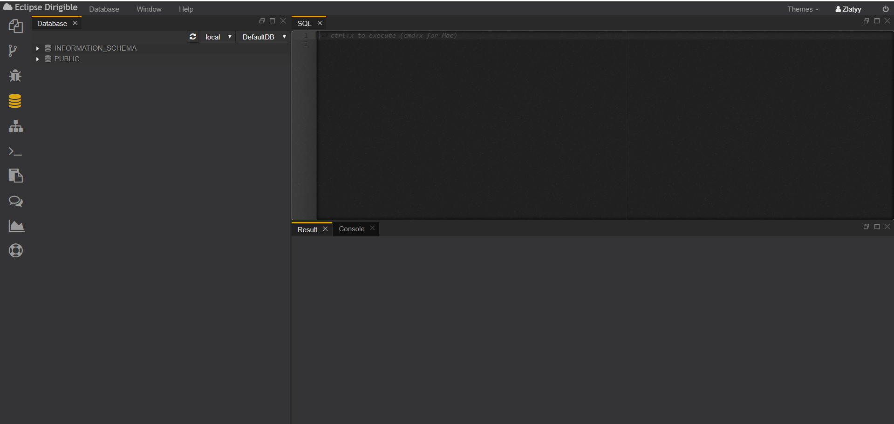
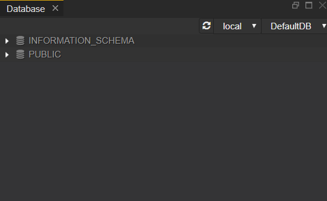
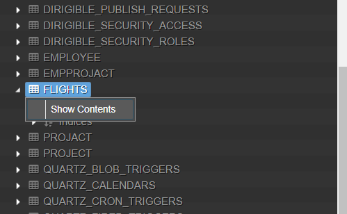
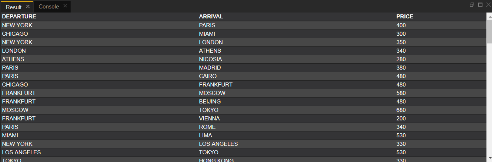
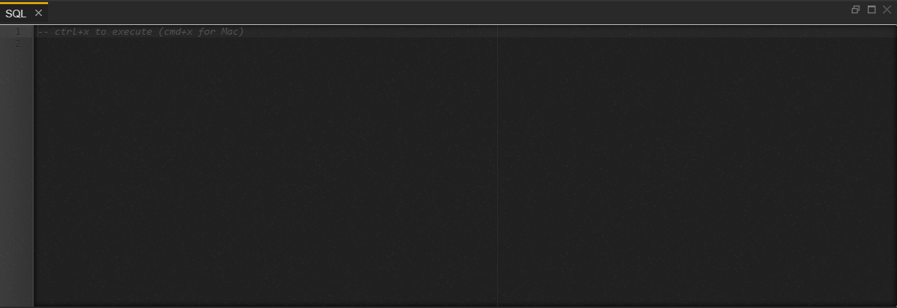
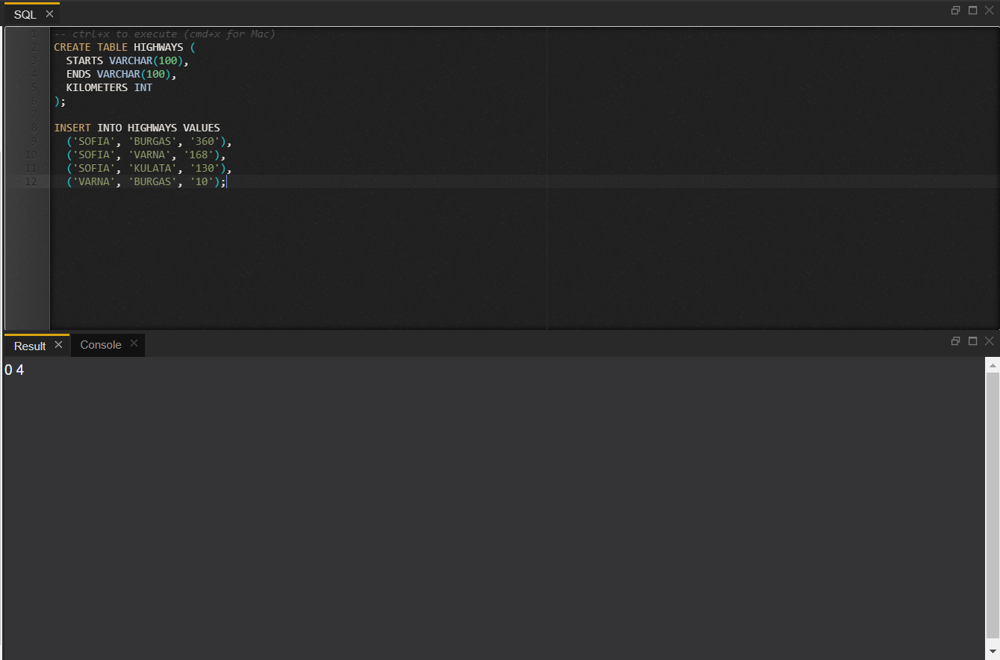
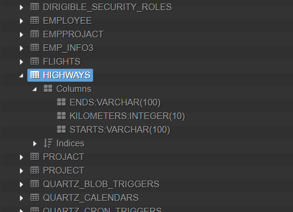
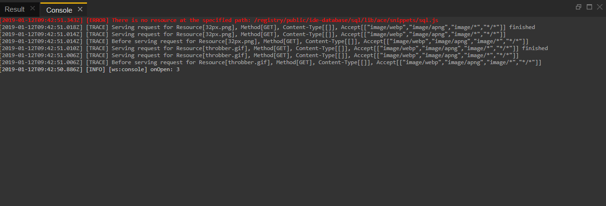
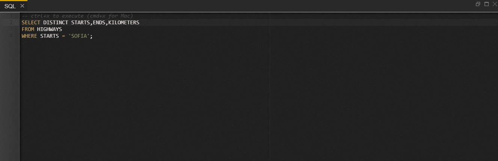

 # Database Perspective
---
The Database perspective contains tools for inspection and manipulation of the artifacts within the underlying relational database.

It is comprised of:
  - Database view
  - SQL view 
  - Console view 
  - Result view

The Database perspective features:
  - a database explorer
  - a console to execute SQL statements and to preview results in table format

## Views
---
### • Database
The Database view gives you direct access to the default target schema assigned to your account in the Web IDE.
It enables you to expand the schema item and see the list of all tables and views created either via the data structures models or directly via SQL script.

For every schema in the Database View you have the option “Show Contents”, which allows you to see the table’s columns and values.

Example:

Result:

---
### • SQL
The SQL view is one of the most powerful and dangerous tool for database management.
In the SQL console you can enter the SQL script compliant to the underlying database system.
You get the result of the execution in the Results view below.

You can also create new tables. After executing the CREATE statement with CTRL+X (CMD+X  for Mac), the table will appear in the Database view.

Example:

Result:

---
### • Console
The Console view is a major debugging tool. Here you can see info for actions you performed and error that occured.

*Note: the log messages in the Console view are in a reverse order - the newest are on top*

---
### • Result
The Result view shows the output of the SQL code you execute after presing CTRL+X (CMD+X  for Mac).

Example:

Result:

